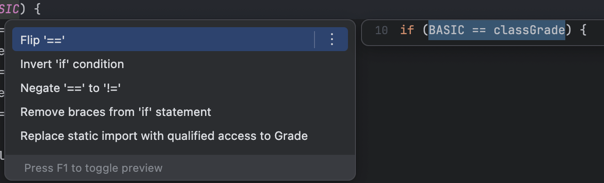

# Section 2. Object클래스
* 부모가 없으면 묵시적으로 Object 클래스를 상속받음
* 객체 정보 출력
```java
Child child = new Child();
String string = child.toString(); //객체의 정보를 String으로 변환
System.out.println(string); //변환된 객체의 정보를 출력
```
* 모든 클래스가 Object클래스를 상속받는 이유
    1. 공통 기능을 제공하기 위해
    2. 다형성의 기본을 구현하기 위해
* Object가 제공하는 기능
  * toString() : 객체의 정보를 제공
  * equals() : 객체의 같음을 비교
  * getClass() : 객체의 클래스 정보 제공
* Object는 모든 객체를 참조할 수 있음 -> 보관하고 싶은 객체가 모두 타입이 다르다면 Object에 보관하면 된다
* Object는 다른 클래스의 메서드를 모르기 때문에 아래와 같이 다운캐스팅을 해야한다
```java
private static void action(Object obj){
        //obj.sound(); //컴파일 오류, Object는 sound()가 없다
        //obj.move(); //컴파일 오류, Object는 move()가 없다

        //객체에 맞는 다운캐스팅 필요
        if(obj instanceof Dog dog){
            dog.sound();
        } else if(obj instanceof Car car){
            car.move();
        }
    }
```
* Object를 print하면 자동적으로 .toString() 메서드가 실행된다
```java
        Object object = new Object();
        String string = object.toString();

        //toString() 반환값 출력
        System.out.println(string);

        //object 직접 출력
        System.out.println(object);
```
* println() 메서드는 Object 매개변수를 사용하고 toString() 메서드를 호출하기 때문에, 모든 객체의 정보를 출력할 수 있었던 것이다
* 정적 의존관계 : 코드에서 클래스 내에서 사용하는 타입들만 보고 파악할 수 있는 의존관계를 말한다
* 동적 의존관계 : 프로그램을 실행 중에 어떤 인스턴스를 사용하는지 알 수 있는 의존관계를 말한다
* 동일성: 참조하는 객체가 동일한지 확인
* 동등성: equals()와 같이 논리적으로 두 객체가 동등한지 확인
* Object와 같은 추상적인 객체의 equals()는 클래스마다 동등성이라는 개념이 다르다, 아래와 같이 최소 하나의 명확한 기준을 잡고 비교를 해야한다
```java
@Override
    public boolean equals(Object obj) {
        UserV2 user = (UserV2) obj; //매개변수가 Object이기 때문에 인스턴스 변수를 사용하기 위해 다운캐스팅
        return id.equals(user.id);
    }
```
* 정확한 equals()를 구현하려면 기존 equals() 오버라이딩을 제거하고, commend + N 으로 equals()를 만든다
* equals() 메서드를 구현할 때 반사성(Reflexivity), 대칭성(Symmetry), 추이성(Transiticity), 일관성(Consistency), null에 대한 비교의 규칙을 만족해야한다

# Section 3. 불변 객체
* 사이드 이펙트(Side Effect): 프로그래밍에서 어떤 계산이 주된 작업 외에 추가적인 부수 효과를 일으키는 것
* 자바에서 여러 참조형 변수가 하나의 객체를 참조하는 공유 참조 문제는 피할 수 없다
* 아래 코드는 b 객체만  "부산"으로 변경된다고 추측할 수 있다
```java
        change(b, "부산");
        System.out.println("부산 -> b");
        System.out.println("a = " + a);
        System.out.println("b = " + b);
```
하지만 a와 b는 같은 객체를 참조하기 때문에 a와 b 모두 "부산"으로 변경되는 문제가 발생한다   
-> 해결책, 객체의 값을 변경하지 못하게 불변 객체(Immutable Object)로 만들면 된다 (객체의 변수를 final로 선언, 값을 변경할 수 있는 setValue() 메서드 제거, 생성자만을 통해 값 설정 등)
* 아래와 같이 불변 객체를 다루는 메서드에서는 새로운 객체를 할당하는 경우가 있다, 이럴 때는 분명히 해당메서드의 반환값을 받아주여야 한다, 그렇지 않으면 반환 객체가 사라진다
```java
    public ImmutableObj add(int addValue) {
        int result = value + addValue;
        return new ImmutableObj(result);
    }
```
* 클래스에는 기본적으로 toString() 메서드가 존재하므로 따로 호출하지 않아도 된다, 오버라이딩 했을떄도 마찬가지다
* 관례적으로 withXxx() 같은 이름의 메서드는 불변 객체의 메서드이다. 이떄는 지정된 수정사항을 포함되는 객체의 새 인스턴스를 반환한다는 의미를 가진다

# Section 4. String 클래스
* String은 클래스임, int, boolean은 참조형
* 자바에서 char -> 2byte, 단순히 영어, 숫자 -> 1byte
* String 클래스의 주요 메서드
  * length()` : 문자열의 길이를 반환한다.
  * `charAt(int index)` : 특정 인덱스의 문자를 반환한다.
  * `substring(int beginIndex, int endIndex)` : 문자열의 부분 문자열을 반환한다.
  * `indexOf(String str)` : 특정 문자열이 시작되는 인덱스를 반환한다.
  * `toLowerCase()` , `toUpperCase()` : 문자열을 소문자 또는 대문자로 변환한다.
  * `trim()` : 문자열 양 끝의 공백을 제거한다.
  * `concat(String str)` : 문자열을 더한다.
* 풀(Pool): 공용 자원을 모아둔 곳
* 문자열 비교는 항상 '==' 대신 equals()를 사용해야한다. 여러 개발자가 작업하는 과정에서 혼란을 야기할 수 있음
* String은 불변 객체이므로 반환 객체를 새로 받아줘야함
* 불변 객체로 구현 된 이유: 문자열 풀에서 같은 문자를 참조하는 참조 객체들의 값이 의도치 않게 변경되는 사이드 이펙트 문제가 발생할 수 있기 때문이다
* CharSequence: String과 StringBuilder의 상위 타입임. 문자열을 처리하는 다양한 객체를 받을 수 있음
* 공백 제거 메서드 trim()과 strip()의 차이
  * trim(): 문자열 양쪽 끝의 공백을 제거한다. 단순 화이트 스페이스만 제거 가능
  * strip(): 화이트 스페이스와 유니코드 공백을 포함하여 제거한다(자바 11부터 지원)
* 주요 메서드 사용법
```java
// 문자열 기본 정보
String str = "Hello, Java!";
System.out.println("문자열의 길이: " + str.length());
        System.out.println("문자열이 비어 있는지: " + str.isEmpty());
        System.out.println("문자열이 비어 있거나 공백인지: " + str.isBlank());
        System.out.println("공백 문자열이 비어 있거나 공백인지: " + "           ".isBlank());

// 문자 접근
char c = str.charAt(7);
System.out.println("7번 인덱스의 문자 = " + c);

// 문자열 비교
String str1 = "Hello, Java!";
String str2 = "hello, java!";
String str3 = "Hello, World!";

System.out.println("str1 equals str2: " + str1.equals(str2));
        System.out.println("str1 equalsIgnoreCase str2: " + str1.equalsIgnoreCase(str2));
        System.out.println("'b' compareTo 'a': " + "b".compareTo("a"));
        System.out.println("str1 compareTo str3: " + str1.compareTo(str3));
        System.out.println("str1 compareToIgnoreCase str2: " + str1.compareToIgnoreCase(str2));
        System.out.println("str1 starts with 'Hello': " + str1.startsWith("Hello"));
        System.out.println("str1 ends with 'Java!': " + str1.endsWith("Java!"));

// 문자열 포함 여부 및 위치
str = "Hello, Java! Welcome to Java world";
        System.out.println("문자열에 'Java'가 포함되어 있는지: " + str.contains("Java"));
        System.out.println("'Java'의 첫 번째 인덱스: " + str.indexOf("Java"));
        System.out.println("인덱스 10부터 'Java'의 인덱스: " + str.indexOf("Java", 10));
        System.out.println("'Java'의 마지막 인덱스: " + str.lastIndexOf("Java"));

// 부분 문자열, 연결, 치환
str = "Hello, Java! Welcome to Java";
        System.out.println("인덱스 7부터의 부분 문자열: " + str.substring(7));
        System.out.println("인덱스 7부터 12까지의 부분 문자열: " + str.substring(7, 12));
        System.out.println("문자열 결합: " + str.concat("!!!"));
        System.out.println("'Java'를 'World'로 대체: " + str.replace("Java", "World"));
        System.out.println("첫 번째 'Java'를 'World'로 대체: " + str.replaceFirst("Java", "World"));

// 대소문자 변환, 공백 제거
String strWithSpaces = "     Java Programming ";
System.out.println("소문자로 변환: " + strWithSpaces.toLowerCase());
        System.out.println("대문자로 변환: " + strWithSpaces.toUpperCase());
        System.out.println("공백 제거(trim): '" + strWithSpaces.trim() + "'");
        System.out.println("공백 제거(strip): '" + strWithSpaces.strip() + "'");
        System.out.println("앞 공백 제거(stripLeading): '" + strWithSpaces.stripLeading() + "'");
        System.out.println("뒤 공백 제거(stripTrailing): '" + strWithSpaces.stripTrailing() + "'");

// split & join
str = "Apple,Banana,Orange";
String[] splitStr = str.split(",");
for (String s : splitStr) {
        System.out.println(s);
}

String joinedStr = String.join("-", "A", "B", "C");
System.out.println("연결된 문자열 = " + joinedStr);

String result = String.join("-", splitStr);
System.out.println("문자열 배열 연결 result = " + result);

// valueOf & toCharArray
int num = 100;
boolean bool = true;
Object obj = new Object();
str = "Hello, Java!";

String numString = String.valueOf(num);
System.out.println("숫자의 문자열 값: " + numString);

String boolString = String.valueOf(bool);
System.out.println("불리언의 문자열 값: " + boolString);

String objString = String.valueOf(obj);
System.out.println("객체의 문자열 값: " + objString);

// 빈 문자열 + 숫자
String numString2 = "" + num;
System.out.println("빈 문자열 + num: " + numString2);

// 문자열을 문자 배열로 변환
char[] strCharArray = str.toCharArray();
System.out.println("문자열을 문자 배열로 변환: " + strCharArray);
for (char ch : strCharArray) {
        System.out.print(ch);
}
        System.out.println();

// format, printf
String format1 = String.format("num: %d, bool: %b, str: %s", num, bool, str);
System.out.println(format1);

String format2 = String.format("숫자: %.2f", 10.1234);
System.out.println(format2);

System.out.printf("숫자: %.3f\n", 10.1234);

// 정규 표현식 matches
String regex = "Hello, (Java!|World)";
System.out.println("'str'이 패턴과 일치하는가? " + str.matches(regex));

```

* StringBuilder는 String과 다르게 private이 없어 수정이 가능하다(가변적이다)
  * 장점: 메모리 사용 감소, 성능 향상
  * 단점: 사이드 이펙트 주의
  * 보편적인 사용법 추천: 먼저 StringBuilder로 문자열을 만들고 toString으로 변환
* 보통 String은 아래와 같이 최적화 한다
```java
String result = str1 + str2;
//아래와 같이 최적화
String result = new StringBuilder().append(str1).append(str2).toString();
```
* String으로 문자열을 10만번 이어붙이면 2.5초가 걸린다. 매 반복마다 새로운 String객체를 생성하기 때문이다
  * StringBuilder으로 하면 0.003초가 걸린다. 기존의 객체를 수정할 수 있기 때문이다
* StringBuilder를 직접 사용하면 더 좋은 경우
  * 반복문에서 반복해서 문자를 연결할 때
  * 조건문을 통해 동적으로 문자열을 조합할 때
  * 복잡한 문자열의 특정 부분을 변경해야 할 때
  * 매우 긴 대용량 문자열을 다룰 떄
* StringBuffer
  * StringBuilder과 같은 기능을 한다
  * 내부에 동기화가 되어, 멀티 쓰레드 환경에서 안전하다
  * 하지만 동기화 오버헤드 때문에 속도가 비교적 느리다
* 메서드 체이닝: 자기 자신의 참조값을 반환하여 메서드 호출을 여러번 연결해서 사용하는 것
```java
        int result = adder.add(1).add(2).add(3).getValue();
```
* StringBuilder는 메서드 체이닝 기법을 지원한다
* indexOf()의 첫 번째 인자는 대상 단어(String | char)이고 두 번째 인자는 탐색 시작 지점이다. 세 번째 인자는 탐색 종료 지점이다. 찾지 못한다면 -1을 반환한다

# Section 5. 래퍼, Class 클래스
* 기본형 데이터의 특징
  * 객체가 아님 -> 메서드 제공 불가
  * null 값을 가질 수 없음
* 숫자를 String으로 변환하려면 String.valueOf(value) 와 같이 사용할 수 있다
* 참조형은 객체이며 null을 사용할 수 있다. 사용할 때 NullPointerException이 발생할 수 있으므로 조심해야 한다
* new Integer() 대신에 valueOf()을 사용하자
```java
Integer newInteger = new Integer(10); //미래에 삭제 예정, 대신에 valueof()를 사용
Integer integerObj = Integer.valueOf(10); //-128 ~ 127 자주 사용하는 숫자 값 재사용(캐싱), 불변, 자바가 최적화 해줌
```
* 박싱(Boxing): 기본형을 래퍼 클래스로 변경하는 것
* 언박싱(Unboxing): 래퍼 클래스에 들어있는 기본형을 다시 꺼내는 메서드
* 래퍼 클래스의 특징
  * 내부의 값을 비교하려면 equals()를 사용해야 한다
  * 객체를 그대로 출력해도 내부에 있는 값을 출력한다 (toString()이 재정의 됨)
* 기본형 <-> 레퍼 클래스 간의 변환이 잦아 아래와 같이 오토 박싱, 언박싱을 만들었다
```java
//Primitive -> Wrapper
int value = 7;
Integer boxedValue = value; //오토 박싱(Auto-Boxing)

//Wrapper -> Primitive
int unboxedValue = boxedValue; // 오토 언박싱(Auto-Unboxing)
```
* parseInt(): 기본형을 반환. 각 타입에 parseXxx()가 존재
* valueOf(): 래퍼 타입을 반환
* 기본형 -> 래퍼 클래스 변환 시
  * 래퍼클래스 변수명 = 래퍼클래스.valueOf(기본형변수명)
  * Integer integer1 = Integer.valueOf(str);
* 래퍼 클래스 -> 기본형 변환 시
  * 기본형타입 변수명 = 래퍼클래스변수명.XxxValue();
  * int intValue = integer1.intValue();
* 래퍼 클래스 vs 기본형
  * 10억번 연산을 수행한 결과 래퍼 클래스가 5배 정도 더 느리다
    * 기본형은 4byte 단순히 값만 더하는 반면, 래퍼 클래스는 객체도 만들고 계속 값도 넣기 떄문에 상대적으로 느린것이다
    * 하지만 일반적인 경우에는 `이런 부분을 최적화 하는 비용` > `코드를 유지보수 하기 좋은 경우` 이므로 후자를 선택하는 것이 낫다 (단, 연산을 지속해서 몇 십만을 한다면 래퍼 클래스를 쓰지 않는게 좋다)
## Class 클래스
* 패키지 명을 작성할 때 class는 예약어 이므로 clazz라고 관례상 적는다
* Class 클래스의 주요 기능
  * 타입 정보 얻기
  * 리플렉션: 클래스에 정의된 메서드, 필드, 생성자 등을 조회, 객체 인스턴스 생성, 메서드 호출
  * 동적 로딩과 생성: Class.forName() 메서드로 동적 로드, newInstance() 메서드를 통해 인스턴스 생성 가능
  * 애노테이션 처리
* throws Exceoption: 여기서는 컴파일 오류를 방지하기 위한 예외 처리
* Class 클래스의 주요 기능**
  * **getDeclaredFields()**: 클래스의 모든 필드를 조회한다.
  * **getDeclaredMethods()**: 클래스의 모든 메서드를 조회한다.
  * **getSuperclass()**: 클래스의 부모 클래스를 조회한다.
  * **getInterfaces()**: 클래스의 인터페이스들을 조회한다.
* 사용자 입력을 받아서 동적으로 객체 만들기
```java
Class helloClass = Class.forName("lang.clazz.Hello");
Hello hello = (Hello) helloClass.getDeclaredConstructor().newInstance();
```
* 리플렉션 (reflection): Class를 사용하여 클래스의 메타정보를 기반으로 클래스에 정의된 메서드, 필드, 생성자 등을 조회하고, 객체 인스턴스 생성, 메서드 호출하는 등의 작업들
* BigDecimal: 매우 정교한 숫자 계산이 필요할 때 사용한다

# Seciotn 6. 열거형 - ENUM
* String 사용 시 타입 안정성이 떨어지는 문제가 발생한다 -> 문자열을 상수로 사용(ENUM)하여 안정성 확보
* 주석으로 다른 개발자에게 지시하려는것 X -> 개발 의도대로 강제 시켜야함 (유지보수 용이)
  * ENUM을 사용하고 입력 가짓수를 의도대로 받게 강제해야함
* ENUM 클래스를 밖에서 생성하지 못하도록 아래와 같이 생성자를 private으로 지정하여 막을 수 있다
```java
public class ClassGrade {
    public static final ClassGrade BASIC = new ClassGrade();
    public static final ClassGrade GOLD = new ClassGrade();
    public static final ClassGrade DIAMOND = new ClassGrade();
    
    // private 생성자 추가
    private ClassGrade() {}
}
```
* ENUM을 사용할 때엔 클래스.ENUM명 으로 사용한다
```java
if (classGrade == ClassGrade.BASIC) {
    discountPercent = 10;
} else if (classGrade == ClassGrade.GOLD) {
    discountPercent = 20;
} else if (classGrade == ClassGrade.DIAMOND) {
    discountPercent = 30;
} else {
    System.out.println("할인X");
}
```
* 앞서 작성한 ClassGrade를 enum으로 작성하면 아래와 같이 간결하게 작성할 수 있다
```java
public enum Grade {
    BASIC, GOLD, DIAMOND
}
```
* enum은 열거형 내부에서 상수로 지정하는것 외에 직접 생성이 불가능하다
* enum을 사용할 때 가독성을 더 좋게 만드는 방법은 열거형을 사용한 곳에(열거형 단어에) 커서를 놓고 option + enter 하면 아래와 같이 메뉴가 나온다. 여기서 enter하면 enum을 import하면서 더욱 직관적인 코드를 작성할 수 있다   

* ordinal()은 가급적 사용하지 않는것이 좋다. 순서가 바뀔 수 있기 때문
* 이전 if문들을 아래와 같이 리팩토링 할 수도 있다
```java
public static final ClassGrade BASIC = new ClassGrade(10);
public static final ClassGrade GOLD = new ClassGrade(20);
public static final ClassGrade DIAMOND = new ClassGrade(30);
```
* 이전 new로 새로운 객체 생성을 하지 않아도 되게 아래와 같이 만들 수 있다
```java
public enum Grade {
    BASIC(10), GOLD(20), DIAMOND(30);

    private final int discountPercent;

    Grade(int discountPercent) {
        this.discountPercent = discountPercent;
    }

    public int getDiscountPercent() {
        return discountPercent;
    }
```
* enum도 클래스이기 때문에 메서드 선언이 가능하다
* 최종적으로 아래와 같이 코드를 리팩토링해서 줄일 수 있다
```java
package enumeration.ref3;

public enum Grade {
    BASIC(10), GOLD(20), DIAMOND(30);

    private final int discountPercent;

    Grade(int discountPercent) {
        this.discountPercent = discountPercent;
    }

    public int getDiscountPercent() {
        return discountPercent;
    }

    // 추가
    public int discount(int price) {
        return price * discountPercent / 100;
    }
}

```
```java
package enumeration.ref3;

public class EnumRefMain3_3 {

    public static void main(String[] args) {
        int price = 10000;

        Grade[] grades = Grade.values();
        for (Grade grade : grades) {
            printDiscount(grade, price);
        }
    }

    private static void printDiscount(Grade grade, int price) {
        System.out.println(grade.name() + " 등급의 할인 금액: " + grade.discount(price));
    }
}

```
* enum에 메서드를 선언 할 때 언제 static을 쓰는가?
  * 특정 열거값의 속성이나 동작 -> 사용안함
  * enum 전체를 대상으로 한 검색, 유틸리티 -> 사용함

# Section 7. 날짜와 시간
* Local: 특정 지역의 날짜와 시간만 고려할 때 사용
* ZonedDateTime: 시간대를 고려해야 할 때 실제 사용하는 날짜와 시간 정보를 나타내는 데 더 적합
* OffsetDataTime: UTC로부터의 고정된 오프셋만을 고려해야 할 때 유용
* Instant: 1970년 1월 1일 0시 0분 0초(UTC)를 기준으로 경과한 시간을 초(나노초 포함) 데이터만 들어있음
* Period: 두 날짜 사이의 간격을 년, 월, 일 단위로 표현
* Duration: 두 시간 사이의 간격을 시, 분, 초(나노초) 단위로 표현
* LocalDate: 날짜만 표현할 때 예) 2013-11-21
* LocalTime: 시간만 표현할 때 예)08:20:30.213
* LocalTime: LocalDate와 LocalTime을 합함 예) 2013-11-21T08:20:30.213
* Local에 시간을 더하는 것과 같은 행위를 하면 불변이므로 객체로 반환값을 받아줘야한다
* isEquals(): 단순히 비교 대상이 시간적으로 같으면 true반환. 객체가 다르고 타임존이 달라도 됨
* equals(): 객체의 타입, 타임존 등 내부 데이터의 모든 구성요소가 같아야 true반환
* ZoneId zoneId = ZoneId.systemDefault(); 는 운영체제가 갖고 사용하는 ZondId를 반환한다
* ZoneId seoulZoneId = ZoneId.of("Asia/Seoul"); 는 해당 지역의 ZoneId를 반환한다
* ZoneId는 일광 절약 시간 관련 정보, UTC와의 오프셋 정보를 포함하고 있다
* ZonedDateTime 클래스: 시간대를 고려한 날짜와 시간을 표현할 때 사용 (출력 예시: 2025-08-07T17:37:29.702075+09:00[Asia/Seoul])
```java
public class ZonedDateTime {
  private final LocalDateTime dateTime;
  private final ZoneOffset offset; // +9시간 과 같은 정보
  private final ZoneId zone;
}
```
* 생성 및 타임존 변경
```java
ZonedDateTime nowZdt = ZonedDateTime.now();
System.out.println("nowZdt = " + nowZdt);

LocalDateTime ldt = LocalDateTime.of(2030, 1, 1, 13, 30, 50);
ZonedDateTime zdt1 = ZonedDateTime.of(ldt, ZoneId.of("Asia/Seoul"));
System.out.println("zdt1 = " + zdt1);

ZonedDateTime zdt2 = ZonedDateTime.of(2030, 1, 1, 13, 30, 50, 0, ZoneId.of("Asia/Seoul"));
System.out.println("zdt2 = " + zdt2);

ZonedDateTime utcZdt = zdt2.withZoneSameInstant(ZoneId.of("UTC")); // 타임존 변경
System.out.println("utcZdt = " + utcZdt); 
```

* `ZonedDateTime` 이나 `OffsetDateTime` 은 글로벌 서비스를 하지 않으면 잘 사용하지 않는다
* Instant 클래스는 아래와 같은 구조를 가진다. 날짜를 계산하기 어렵기 때문에 날짜 변환이 필요없는 곳에 사용된다
```java
public class Instant {
    private final long seconds; // 이 초는 1970년 1월 1일 부터 카운트 된다
    private final int nanos;
...
}
```
* 활용
```java
// 생성
        Instant now = Instant.now(); // UTC 기준
        System.out.println("now = " + now);

        ZonedDateTime zdt = ZonedDateTime.now();
        Instant from = Instant.from(zdt);
        System.out.println("from = " + from);

        Instant epochStart = Instant.ofEpochSecond(0); // 1970년 1월 1알 0시 0분 0초에 + 0초 한 결과
        System.out.println("epochStart = " + epochStart);

        // 계산
        Instant later = epochStart.plusSeconds(3600); // 1970년 1월 1알 0시 0분 0초에 + 3600초 한 결과
        System.out.println("later = " + later);

        long laterEpochSecond = later.getEpochSecond(); // 1970년 1월 1알 0시 0분 0초 부더 흐른 시간 (초)
        System.out.println("laterEpochSecond = " + laterEpochSecond); 
```
* Period: 두 날짜 사이의 간격을 년, 월, 일 단위로 표현
* Duration: 두 시간 간격을 시, 분, 초(나노초)로 표현
## 각 개념 사용법은 코드 참조
* Duration의 toMinutesPart()는 60분을 나눈 나머지를 반환한다
* TemporalAccess 인터페이스: 날짜와 시간을 읽기 위한 기본 인터페이스
* Temporal 인터페이스: 날짜와 시간을 조작하기 위한 기능을 제공
* TemporalAmount 인터페이스: 시간의 간격을 나타내며, 날짜와 시간 객체에 적용하여 그 객체를 조정할 수 있다
* ChronoUnit -> TemporalUnit <interface>
* ChronoField -> TemporalField <interface>
* ChronoUnit: 날짜, 시간 등등을 .열겨형 으로 사용할 수 있다
* ChronoField: 날짜와 시간의 특정 부분을 나타낸다
## 정확한 필드들은 강의자료 6. 날짜와 시간 참고
* LocalDateTime을 변경 및 수정할 땐 TemporalAdjusters 클래스를 사용한다
* 포맷팅: 날짜와 시간 데이터를 원하는 포맷의 문자열로 변경 
```java
        LocalDate date = LocalDate.of(2024, 12, 31);
        DateTimeFormatter formatter = DateTimeFormatter.ofPattern("yyyy년 MM월 dd일");
        String formattedDate = date.format(formatter);
```
* 파싱: 문자열을 날짜와 시간 데이터로 변경
```java
        String input = "2030년 01월 01일";
        LocalDate parseDate = LocalDate.parse(input, formatter);
        System.out.println("문자열 파싱 날짜와 시간: " + parseDate);
```
* 날짜를 더한다고 하면 ChronoUnit.단위 로 더하면 된다
```java
LocalDate nextDate = date.plus(2 * i, ChronoUnit.WEEKS);
```
* `LocalDateTime dateTime = LocalDateTime.of(year, month, 1, 0, 0, 0);` 에서 일을 최소 1로 놔야 오류가 안난다

* 각 용도별 메서드 표는 6.날짜와 시간.pdf 맨 아래에 정리되어 있다

# Section 8. 중첩 클래스, 내부 클래스1
* 중첩: 어떤 다른 것이 내부에 위치하거나 포함되는 구조적인 관계
* 내부: 나의 내부에 있는 나를 구성하는 요소
* 중첩클래스는 둘이 아주 긴밀하게 연결되어 있는 특별한 경우에만 사용해야 한다. 그렇지 않으면 안에 있는 클래스를 밖으로 빼야한다
* 자바에서는 안쪽에 있는 클래스를 $ 표시로 구분한다
* 정적 중접 클래스의 유일한 기능은 private 접근 제어자에 접근 할 수 있다는 정도이다
* 나의 클래스에 포함된 중첩 클래스가 아니라 다른 곳에 있는 중첩 클래스에 접근할 때는 바깥클래스.중첩클래스 로 접근해야한다
* 정적 중첩 클래스는 그냥 클래스 2개 만든것과 같다. private에 접근할 수 있느것 빼고는 그냥 관계가 없고 중첩만 해둔것이다
* 내부 인스턴스를 생성할 때 바깥 인스턴스의 참조값을 들고 있기 때문에 바깥 인스턴스의 private에 접근할 수 있는것이다
* 내부 클래스는 단독으로 생성하지 못한다. 무조건 바깥 클래스를 생성하고 그 다음에 생성가능하다
* 중첩 클래스를 사용하면 getXxx()와 같이 내부의 정보를 노출할 위험이 적어지면서 더욱 캡슐화를 할 수 있다
* 중첩클래스를 사용하는 이유
  * 논리적 그룹화
  * 캡슐화
* 같은 이름의 바깥 변수를 호출하는 법
```java
public class ShadowingMain {

    public int value = 1;

    class Inner {
        public int value = 2;

        void go() {
            int value = 3;
            System.out.println("value = " + value);
            System.out.println("this.value = " + this.value);
            System.out.println("ShadowingMain.value = " + ShadowingMain.this.value);
        }
    }

    public static void main(String[] args) {
        ShadowingMain main = new ShadowingMain();
        Inner inner = main.new Inner();
        inner.go();
    }
}
```

# Section 9. 중첩 클래스, 내부 클래스2
* 지역 클래스는 지역 변수에 접근할 수 있음
* 지역 클래스는 지역 변수 처럼 접근 제어자를 사용할 수 없다. 접근 제어자는 멤버 변수에 사용 가능
* 클래스 변수: 프로그램 종료까지, 가장 김 (메서드 영역)
* 인스턴스 변수: 인스턴스의 생존 기간동안 힙 영역에 존재, 어느정도 김
* 지역 변수: 메서드 호출이 끝나면 사라진다, 가장 짧음 (스택 영역)
* GC가 되려면 참조하고 있는 변수들이 사라져야 하는데 지역 클래스 인스턴스가 main에서 계속 살아남는다면 main이 종료될 때 까지 생존한다
  * 하지만 지역 변수의 생명주기는 짧다. 그렇다면 main에서 어떻게 지역 클래스 인스턴스가 이미 종료된 지역 변수 값을 가지고 있는것일까?
  * 이는 인스턴스를 생성할 때 필요한 지역 변수만 복사해서 보관해두면서 가능하게 된다
  * `Field[] fields = printer.getClass().getDeclaredFields();`를 통해 볼 수 있다
    ```
    field = int nested.local.LocalOuterV3$1LocalPrinter.value // 인스턴스 변수
    field = final int nested.local.LocalOuterV3$1LocalPrinter.val$localVar // 캡처 변수 
    field = final int nested.local.LocalOuterV3$1LocalPrinter.val$paramVar // 캡처 변수
    field = final nested.local.LocalOuterV3 nested.local.LocalOuterV3$1LocalPrinter.this$0 // 바깥 클래스를 참조하기 위한 필드
    ```
* 지역 클래스가 접근하는 지역 변수는 절대로 중간에 값이 변하면 안됨 -> final로 선언하거나 사실상 final (선언하고 중간에 값을 한번이라도 바꾸면 안됨)이어야 한다
  * 중간에 값을 바꾼다면 인스턴스 생성시에 캡처한 변수와 다르게 되므로 동기화 문제가 생긴다
  * 지역 변수 값을 변경한다면
    * 켑처한 변수의 값도 변경해야함
  * 인스턴스에 있는 캡처 변수의 값을 바꾼다면
    * 지역 변수의 값도 변경해야함
  * 총체적으로 예상치 못한 곳에서 값을 변경할 수 있어 디버깅을 어렵게 한다
  * 캡처한 지역 변수를 못바꾸게만 한다면 위에서 말한 문제들을 근본적으로 차단한다. 값을 바꿔야 한다면 다른 새로운 변수를 생성하면 된다
* 익명 클래스: 클래스의 본문(body)를 정의하면서 동시에 생성한다
  * 사용하는 이유
    * 클래스를 별도로 저으이하지 않고도 인터페이스나 추상 클래스를 즉석에서 구현할 수 있어 코드가 더 간결해짐
  * 하지만 단 한번만 생성이 가능하므로 여러번 생성해야한다면 사용하면 안됨다
* 변하는 부분과 변하지 않는 부분을 잘 구분하여 리팩토링 해야한다
* 코드 조각을 메서드에 전달할 때는 인스턴스를 전달하고 해당 인스턴스에 있는 메서드를 호출하면 된다
* 익명 클래스를 참조값 직접 전달로 전환하여 더욱 코드를 짧게 만들 수 있다
```java
    hello(new Process() {

            @Override
            public void run() {
                int randomValue = new Random().nextInt(6) + 1;
                System.out.println("주사위 = " + randomValue);
            }
        });
```
* 람다: 메서드의 코드 블럭을 직접 전달할 수 있다
* iter을 통해 배열을 출력할 때 안채워진 요소가 있다면 null 요소에 접근하여 nullPointerException이 발생 할 수 있으므로 fori 로 출력하는게 좋다
* if문을 사용할 때 검증로직을 먼저 거치고 정상로직을 처리하는게 좋다

# Section 10. 예외 처리1 - 이론
* if (!sendResult.equals("success")) 와 같은 조건을 ctrl + T 를 누른 후 Extract Method를 하면 isError과 같이 변경해서 따로 메서드로 뺄 수 있다 -> 직관성이 좋아진다
* 자바 외부에 있는 자원은 GC가 자동으로 되는것이 아니기 때문에 사용 후에는 연결을 해제해서 외부 자원을 반드시 반납해야한다. 추후 문제가 될 수 있기 때문이다
* 자바에서 기본형을 제외한 모든것은 객체이므로 예외도 객체이다
* **자세한 예외 객체는 9.예외처리1 - 이론.pdf 15페이지를 참고하자**
* 체크 예외는 발생한 예외를 개발자가 명시적으로 처리해야한다. 그렇지 않으면 컴파일 오류가 발생
* 언체크 예외는 개발자가 발생한 예외를 명시적으로 처리하지 않아도 된다
* 예외를 처리하지 못하면 자신이 호출한 곳을 예외를 던져야 한다
* 예외 기본 규칙 2가지
  1. 예외는 잡아서 처리하거나 밖으로 던진다
  2. 예외를 잡거나 던질 떄 지정한 예외 뿐만 아니라 그 예외의 자식들도 함께 처리할 수 있다
* 예외를 처리할 수 없을 때 계속 예외를 던지다가 main() 밖으로 던지면서 예외 로그를 출력하면서 시스템이 종료된다. 메시지와 예외 로그로 예외가 터지는 경로를 출력해준다 (스택 트레이스)
* throw new 예외: 새로운 예외를 발생시킬 수 있음
* throws 예외: 발생시킨 예외를 메서드 밖으로 던질 때 사용하는 키워드
* 체크 예외에서 예외를 잡지 않고 밖으로 던지려면 throws 예외를 메서드에 필수로 선언해야한다
* 체크 예외를 밖으로 던지지 않으면 컴파일 오류가 발생한다
* throws에 MyCheckException의 상위 타입인 Exception을 던져도 다 포함해서 예외를 던진다. 단, 정확하게 던지고 싶다면 명시적으로 적어주어야 한다
* 체크 예외는 개발자가 실수로 예외를 누락하지 않도록 컴파일러를 통해 문제를 잡아주는 장치이다
* 언체크 예외: 컴파일러가 예외를 체크하지 않는다는 뜻. 체크 예외와는 달리 throws를 선언하지 않고 생략 가능하다. 생략 시 자동으로 예외를 던진다
* 언체크 예외도 필요한 경우 예회를 잡아서 처리할 수 있다
* 현대 애플리케이션에서는 체크 예외를 잘 쓰지 않는다. 